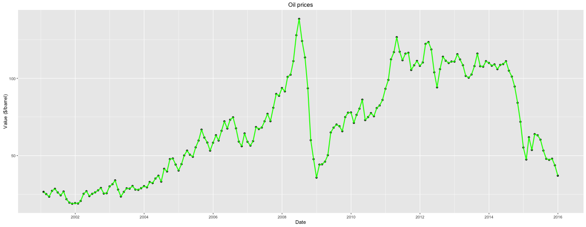

Data products project - Oil prices pitch
========================================================
author: Evgeniy Zabrodskiy
date: Tue Feb  9 13:53:19 2016

Summary
========================================================

The oil prices have significant impact on the economy 
of many countries and it is convenient to have access to
data sources to create graphs and perform different types
of analysis using that data.  

The data source of oil prices used in this project is **Quandl**.

The application allows one to select different parameters:
- The color of the graph;
- The time period of oil prices to be presented by the 
graph;
- The period of a dot of the graph, i.e. daily, weekly, 
monthly, etc.

Oil Prices Data
========================================================

Below is the dataframe example which is obtained from 
**Quandl** and is used in the application for graph creation.  


```r
oil <- Quandl("DOE/RBRTE", 
       trim_start="2001-01-01", 
       trim_end="2016-02-01", 
       type="raw", collapse="monthly", 
       order = "asc")
str(oil)
```

```
'data.frame':	180 obs. of  2 variables:
 $ Date : Date, format: "2001-01-31" "2001-02-28" ...
 $ Value: num  26.6 25.2 23.5 27.2 28.6 ...
 - attr(*, "freq")= chr "daily"
```

Oil Prices Plot
========================================================
For the dataset obtained for selected dates, the resulting 
plot looks like this:  



Conclusions
========================================================

Even though the application showing oil prices is quite
simple, it allows to visualize oil prices in a nice way 
and provides the user with some level of flexibility, 
such as choosing the time period, density of the graph 
and the color.
